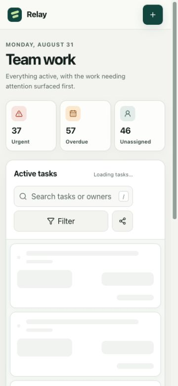
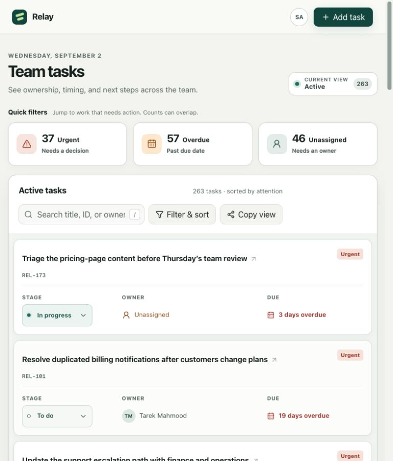
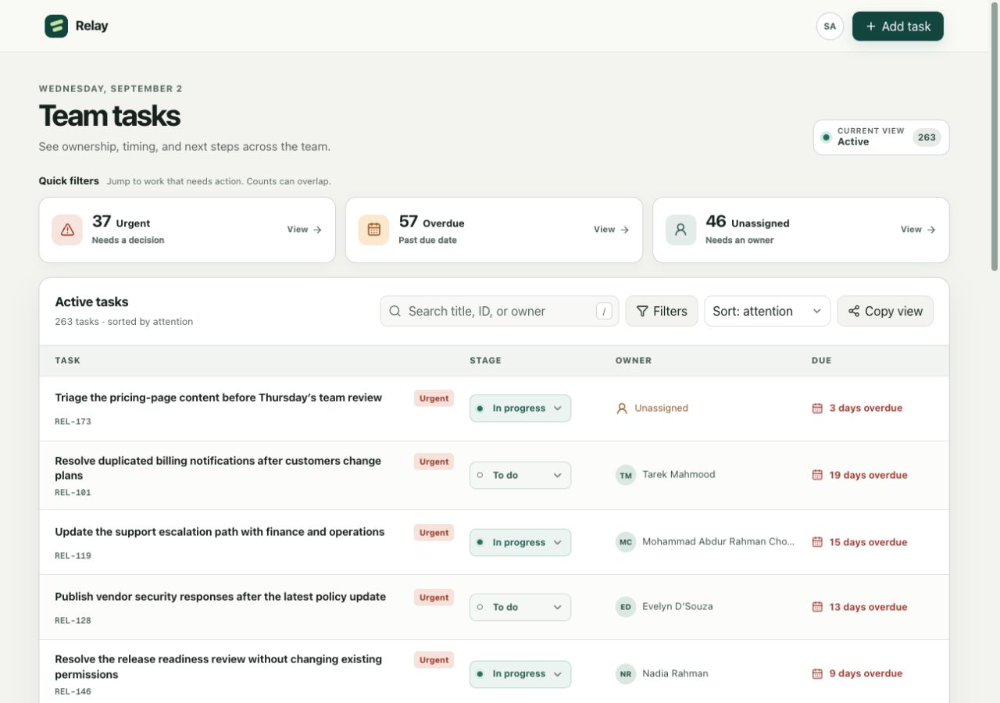

# Relay

Relay is a focused team work list for answering three questions quickly: **what is active, what needs attention, and who owns it?** It deliberately optimizes for scanning, finding, and moving work rather than trying to be a full project-management suite.

**Hosted preview (project access required):** [relay-task-workspace-2026.swop-id.chatgpt.site](https://relay-task-workspace-2026.swop-id.chatgpt.site)

## Screenshots

The same default Active view is shown at the three assessment widths.

| 375px — mobile | 768px — tablet | 1280px — desktop |
| --- | --- | --- |
|  |  |  |

## Run from a clean clone

Requirements:

- Node.js 22.13 or newer (the exact development version is in `.nvmrc`)
- npm

```bash
git clone <repository-url>
cd relay-team-task-system
npm ci
npm run dev
```

Open [http://localhost:3000](http://localhost:3000). There are no environment variables, credentials, database, or seed steps.

Production and quality checks:

```bash
npm run lint
npm run typecheck
npm run build
npm run start
```

## Product model

### Work item

| Field | Type | Why it earns its place |
| --- | --- | --- |
| `id` | stable string | A short, shareable reference for support conversations |
| `title` | string | The primary scan and search anchor |
| `description` | nullable string | Context that stays behind the detail action so it does not reduce list density |
| `status` | `todo \| in_progress \| done` | The smallest workflow in which every stage changes the next action |
| `ownerId` | nullable member ID | Normalized ownership; `null` is meaningful because unassigned work is a primary attention state |
| `dueDate` | nullable `YYYY-MM-DD` | Optional because not every item has a credible deadline; date-only avoids accidental timezone shifts |
| `urgent` | boolean | Exceptional attention without an arbitrary P0–P3 ladder |
| `createdAt`, `updatedAt` | ISO timestamps | Stable sort tie-breakers and a clean path to future recency/audit features |

Members are separate records referenced by `ownerId`. **Overdue**, **due today**, **unassigned**, and **needs attention** are derived rather than stored, so duplicated flags cannot drift out of sync. A task is overdue only when its date is before today and its status is not Done.

The frontend creates 320 deterministic fixture items on load. The fixture includes:

- very short, very long, unbroken, and non-Latin titles;
- 12 team members, including deliberately inconvenient names;
- missing owners, descriptions, and due dates;
- overlapping urgent, overdue, and unassigned states;
- due dates generated relative to the current day, so the test data does not rot after review day.

### Workflow

The workflow is intentionally only **To do → In progress → Done**. It is generic enough for a mixed 8–15-person team, and each stage changes what somebody should do next. New work defaults to To do.

I left out:

- **Backlog / Ready**, because that boundary is inconsistent without explicit planning rules;
- **Review**, because not every item has an approval step;
- **Blocked**, because blockage is a condition that can affect work in any stage rather than a universal stage of its own.

## Product decisions

### A responsive list, not a board

The brief emphasizes finding and narrowing hundreds of items. A list keeps title, stage, owner, and due date in a stable reading path and paginates predictably. It also avoids horizontally scrolling Kanban columns on a phone.

Status still moves in one explicit, keyboard-accessible control, so drag-and-drop is not required for the core workflow.

The default view is **Active** (To do + In progress), sorted by **Needs attention**. Completed work remains available through the stage filter but does not crowd the working set. The three attention summaries—Urgent, Overdue, and Unassigned—are controls, not decorative analytics: selecting one narrows the same list.

Needs-attention sorting promotes incomplete urgent, overdue, due-today, due-soon, and unassigned work, then uses deterministic due-date and ID tie-breakers.

### What is on the first screen

At 1280px the first screen contains:

1. Add task;
2. attention summaries;
3. search, filters, sort, and share;
4. the four columns that earn their space: Title, Stage, Owner, and Due.

Urgency stays attached to the title instead of consuming another column. Descriptions and secondary fields live in the task dialog. Quick add requires only a title; ownership, timing, and urgency are optional.

### Mobile adaptation

- At **768px**, each row becomes a compact two-line layout: title and stage retain priority while due information sits with ownership.
- At **375px**, rows become semantic task cards rather than a squeezed or scrolling table.
- Search remains immediately available.
- One thumb-sized Filter button opens a bottom sheet containing stage, owner, attention, and sort controls.
- The sheet has explicit Apply and Clear actions; cancelling does not change the URL.
- Task and add dialogs become full-width bottom sheets with scrollable bodies and sticky actions.
- Essential information—title, urgency, stage, owner, and due state—remains visible without opening the task.

Touch targets are at least 44px for primary mobile actions. Long text is deliberately clamped or ellipsized in the scan view but remains complete in accessible names and the detail dialog.

### Shareable URL state

Search, stage, owner, attention, sort, and page are represented by the query parameters `q`, `status`, `owner`, `attention`, `sort`, and `page`. Defaults are omitted to keep the URL readable.

The URL is the source of truth:

- pasting a link recreates the same view;
- discrete filter, sort, and pagination changes add useful history entries;
- every search edit replaces the current entry instead of flooding history;
- browser Back and Forward restore controls and results;
- filter/search changes reset pagination, and invalid pages are clamped and corrected.

## Interaction and failure states

Relay distinguishes the states the brief calls out:

- **Loading** reserves six row-shaped skeletons and exposes `aria-busy`.
- **Error** explains what failed while preserving the view and offers a working Retry.
- **True empty** explains how to start and offers Add first task.
- **Filtered empty** explains that the current view is too narrow and offers Clear filters.
- Successful adds, edits, sharing, and stage changes use a restrained live-region message.
- If a stage change or edit makes an item leave the current filter, the message says where it went instead of letting it silently disappear.

The review states are intentionally reachable without changing source:

- [Loading state](http://localhost:3000/?demo=loading)
- [Retryable error](http://localhost:3000/?demo=error)
- [True empty state](http://localhost:3000/?demo=empty)
- [Filtered empty state](http://localhost:3000/?q=no-task-can-match-this-query)

Hover, focus-visible, active, and disabled treatments are defined for the interactive controls. Dialog and sheet behavior comes from accessible headless primitives, including focus containment, Escape close, background inertness, and trigger-focus return. Status, urgency, due state, and missing ownership use text and icon/shape cues in addition to color. Reduced-motion preferences disable nonessential movement.

## Architecture

- `app/page.tsx` owns the page-level URL, task, selection, and notification state.
- `app/components/task-list.tsx` owns list/card presentation and loading/error/empty variants.
- `app/components/filter-sheet.tsx` owns committed-versus-draft filter behavior.
- `app/components/task-dialogs.tsx` owns focused add and edit forms.
- `lib/task-data.ts` owns the data model, relative fixture generation, and date-only helpers.
- `lib/task-query.ts` owns query parsing/serialization, filtering, and deterministic sorting.
- `app/globals.css` holds the visual tokens and responsive component rules.

The interface uses React, TypeScript, plain CSS/Tailwind utilities, Lucide icons, and locally owned Base UI/shadcn headless primitives. It does not use a prebuilt screen, theme, data grid, or visual component kit.

## Intentional scope cuts

- **No backend or persistence.** The frontend assessment time is spent on interface quality, responsive behavior, realistic data, URL state, and edge cases. Adds and edits are session-only and reset on reload. A shared URL shares the view, not local fixture mutations.
- **No authentication, roles, or user administration.** The brief describes one trusted team, so Relay models the work experience rather than account management.
- **No comments or attachments.** Those turn the item into a collaboration/document system before the scan–find–move loop is proven.
- **No drag-and-drop.** An explicit stage control is faster to make reliable across pointer, keyboard, and touch.
- **No multiple projects or boards.** The problem describes one shared body of work. A single list plus shareable views meets that need without inventing hierarchy and permissions.
- **No bulk actions, notifications, analytics, subtasks, tags, or audit log.** Each expands the interaction and responsive surface without strengthening the core loop.

These are product boundaries, not claims that the capabilities are unimportant. Persistence and shared mutations would be the first expansion after validating the list workflow; filtering, search, sort, and pagination would then move behind an API.

## Decisions I am least confident about

1. **List-only versus an optional board.** The list is stronger for search, density, pagination, and mobile, but a team that spends most of its time balancing stages may prefer a board. I would add a board as a second URL-backed presentation only after usage showed stage overview mattered more than scanning.
2. **Three stages versus a dedicated Review stage.** Three stages avoid prescribing process, but they compress “finished by the owner, awaiting approval” into In progress. If review queues repeatedly become invisible, Review is the first stage I would add; I would still model Blocked as a reason/flag rather than a stage.
3. **20-item pagination versus virtualization or infinite scroll.** Pagination makes position, sharing, back navigation, and keyboard behavior predictable. Virtualization would support faster uninterrupted scanning, but adds state-restoration complexity and makes a precise shared location less clear.

## AI tooling

I used **OpenAI Codex** as a pair-programming agent to interpret the brief, compare product and data-model options, draft components and styles, generate realistic fixtures, debug, review accessibility and responsive behavior, exercise browser interactions, and edit this README. I selected the final product direction and reviewed and adapted the generated output.

The practical follow-up requires being able to explain and change every submitted line; this disclosure is intentionally broad rather than presenting substantial generated work as autocomplete.

## Known limitations

- Created and edited items persist only for the current browser session.
- The current user (“Samira Ahmed”) is illustrative because authentication is outside scope.
- Search is a simple case-insensitive substring match across task ID, title, and owner.
- The demo-state query parameter is an assessment aid, not a production feature.
